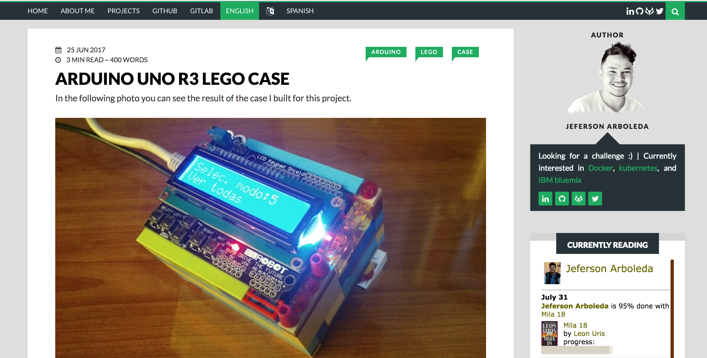

# blog-hugo
Hugo blog template
# blog-hugo
> Hugo blog template ! [Demo](https://www.jarboleda.me)



## Installation

You'll need [Hugo](https://gohugo.io/). You can use deploy.sh to deploy to github pages. [More info](https://gohugo.io/hosting-and-deployment/hosting-on-github/)
## Usage example
```sh
$ hugohugo server --watch
$ gulp
```

## Development setup

You'll need [Hugo](https://gohugo.io/) and [gulp](https://gulpjs.com/) along with the required packages.

## Credits
* [Hugo](https://gohugo.io/)

## Optimizations
* [Lighthouse “Links do not have a discernible name”](https://stackoverflow.com/questions/51683761/how-to-fix-lighthouse-links-do-not-have-a-discernible-name)
* [Lighthouse “Pre-load webfonts”] (https://support.google.com/webmasters/thread/6664618?hl=en)
* [Lighthouse “Pre-load webfonts (mozilla)”] (https://developer.mozilla.org/en-US/docs/Web/HTML/Preloading_content#Cross-origin_fetches)
* [Compress images] (https://stackoverflow.com/questions/7261855/recommendation-for-compressing-jpg-files-with-imagemagick)

## Meta

Jeferson Arboleda – me@jarboleda.me - https://www.jarboleda.me

Distributed under the MIT license. See ``LICENSE`` for more information.

[https://gitlab.com/jag7](https://gitlab.com/jag7)

[npm-image]: https://img.shields.io/npm/v/datadog-metrics.svg?style=flat-square
[npm-url]: https://npmjs.org/package/datadog-metrics
[npm-downloads]: https://img.shields.io/npm/dm/datadog-metrics.svg?style=flat-square
[travis-image]: https://img.shields.io/travis/dbader/node-datadog-metrics/master.svg?style=flat-square
[travis-url]: https://travis-ci.org/dbader/node-datadog-metrics
